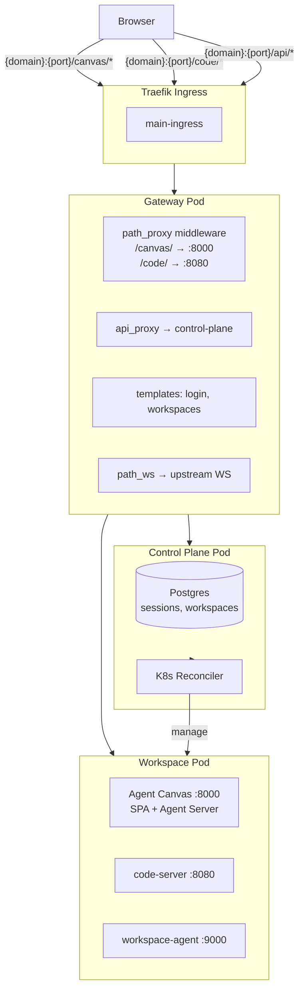

# Agent Workspace Platform — Architecture

## Overview

Multi-user coding-agent workspace platform: per-user workspace pods with Agent Canvas (chat + ACP agent) and code-server behind a session-aware gateway, deployed on a single-node K3s cluster.

## Architecture



## Routing

### Path-based (primary)

| Path | Upstream Port | Service |
|---|---|---|
| `/canvas/` | 8000 | Agent Canvas (OpenHands Agent Server + UI) |
| `/code/` | 8080 | code-server |

Requests to `/canvas/*` or `/code/*` hit the gateway's `path_proxy` middleware. It validates the session cookie, resolves the user's workspace routing, strips the path prefix, and proxies to the workspace pod's cluster IP at the appropriate port.

### Path-based (legacy)

| Path | Upstream Port | Service |
|---|---|---|
| `/chat/*` | 6767 | Paseo (legacy, preserved for backward compatibility) |

## Components

### Gateway (FastAPI)

- **Session validation**: Validates `session` cookie against control-plane on every workspace request
- **Workspace resolution**: Calls `GET /api/internal/workspaces/{id}/routing` (service-auth) to get pod cluster IP and state
- **Hibernation wake**: If workspace is hibernated, triggers start and shows a "starting" page with auto-refresh
- **WebSocket relay**: Generic `_relay_ws` handler proxies WebSocket frames bidirectionally for agent-server communication
- **HTML modification**: Rewrites root-relative asset paths (`/assets/` → `/canvas/assets/`) and injects `<base>` tags for sub-path serving
- **HTML templates**: Login page, workspace manager, error pages, starting page

### Control Plane (FastAPI)

- **Auth**: Password-based login, bcrypt-hashed, session cookies with configurable domain
- **Workspace CRUD**: Create, read, hibernate, delete workspaces in Postgres
- **K8s reconciler**: Background loop (30s interval) that reconciles workspace state → K8s resources (Namespace, PVC, Service, Deployment, RBAC, NetworkPolicy, ResourceQuota)
- **Idempotency**: Idempotency-key dedup for lifecycle operations
- **Audit trail**: All workspace and auth events logged to Postgres

### Workspace Pod

- **Agent Canvas** (:8000): OpenHands Agent Server with pre-built SPA frontend. The Agent Server spawns ACP-compatible agent CLIs (Claude Code, Codex, etc.) as subprocesses. Configured via `agent-canvas --port 8000` from the `@openhands/agent-canvas` npm package.
- **code-server** (:8080): VS Code in the browser (fallback/debug tool)
- **workspace-agent** (:9000): Lightweight Python HTTP server for health checks, readiness, port exposure, activity tracking

### Agent Canvas / ACP Flow

```
Agent Canvas UI → Gateway Proxy → Workspace Pod :8000
                                    ├── Ingress Proxy → Static Frontend (:3001)
                                    └── Ingress Proxy → Agent Server (:18000)
                                                         └── ACP subprocess
                                                              └── npx @agentclientprotocol/claude-agent-acp
                                                                   └── Claude Code CLI
```

The Agent Canvas ingress proxy (`:8000`) serves the SPA and routes `/api/*`, `/sockets`, `/health` to the Agent Server (`:18000`). The Agent Server spawns the ACP adapter as a subprocess over stdio JSON-RPC. The ACP adapter manages the agent's own LLM credentials and tool execution on the workspace PVC.

## State Machine

```
trigger_start
    │
    ▼
"requested" ──→ "starting" ──→ "running" ──→ "idle_pending" ──→ "hibernating" ──→ "hibernated"
(30s poll)     (create K8s,    (pod ready,    (reconciler     (scale to 0)     (0 replicas)
               deploy scale=1)  proxy active)  detects idle)
```

## Key Decisions

### Why path-based routing instead of subdomains?

Path-based (`/{service}/`) avoids DNS management per service, simplifies cookie handling (no cross-subdomain cookie domain needed), and works with a single `/etc/hosts` entry. Agent Canvas and code-server both support sub-path serving through `<base>` tag injection and root-relative path rewriting.

### Why a gateway at all (not pure Traefik)?

Traefik routes to static backends. The gateway resolves "user alice → pod IP:port" dynamically per request, validates sessions, triggers workspace wake-ups, and modifies proxied HTML for sub-path support — none of which a static Ingress can express.

### Why not per-user subdomains (alice.chat.*)?

Requires wildcard DNS and per-user TLS certs at the ingress level. For a single-node lab MVP, path-per-service is simpler.

### Database

Postgres via StatefulSet with `local-path` StorageClass. SQLite via Kine was tried first but had severe write latency on forced write-through RAID. ZFS with `sync=disabled` + Postgres was the fix.

### Container runtime

K3s with containerd. Image pulls from a local Docker registry. Unique versioned image tags per build to bypass containerd's manifest caching.

## Repository Structure

```
agent-workspace/
├── README.md
├── ARCHITECTURE.md
├── DEPLOY.md
├── ROADMAP.md
├── openapi.yaml                  # API contract
├── requirements.md               # Original requirements doc
├── scripts/
│   └── build-images.sh           # Build all service images
├── services/
│   ├── gateway/
│   │   ├── Dockerfile
│   │   ├── main.py               # FastAPI gateway app
│   │   └── templates/            # Jinja2 HTML templates
│   └── control-plane/
│       ├── Dockerfile
│       ├── main.py               # FastAPI control-plane
│       ├── reconciler.py         # K8s resource reconciler
│       ├── auth.py               # Password hashing, sessions
│       ├── schemas.py            # Pydantic models
│       ├── models.py             # SQLAlchemy ORM
│       ├── database.py           # Async SQLAlchemy setup
│       ├── audit.py              # Audit trail helpers
│       └── idempotency.py       # Idempotency store
└── charts/
    └── agent-platform/
        ├── Chart.yaml
        ├── values.yaml
        ├── values.local.example.yaml
        └── templates/
            ├── control-plane-deployment.yaml
            ├── control-plane-service.yaml
            ├── gateway-deployment.yaml
            ├── gateway-service.yaml
            ├── postgres-statefulset.yaml
            ├── postgres-service.yaml
            ├── rbac.yaml
            ├── secrets.yaml
            ├── configmaps.yaml
            ├── networkpolicies.yaml
            └── ingress.yaml
```
